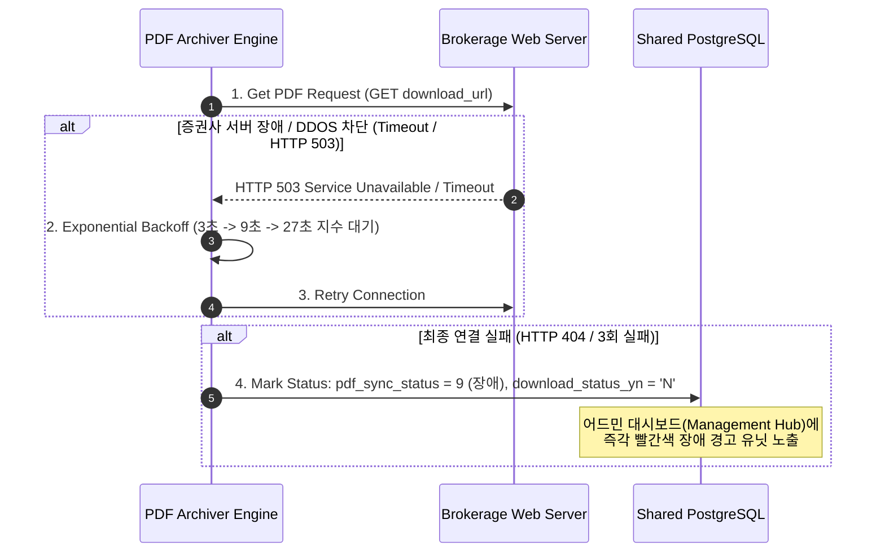

# PDF 아카이브 테이블 설계 문서

> 작성일: 2026-05-28  
> 설계자 본인도 헷갈려서 정리함. 향후 수정 시 이 문서를 먼저 업데이트할 것.

---

## 1. 테이블 관계

```
tbl_sec_reports (원본 리포트)
    │ report_id (PK)
    │ sync_status      ← 스크래퍼가 기록 (수집 동기화 상태)
    │ pdf_sync_status  ← pdf-archiver가 기록 (PDF 처리 상태)
    │
    └── 1:1 (LEFT JOIN) ── tbl_sec_reports_pdf_archive (PDF 아카이브)
                                report_id (PK, FK)
                                archive_status   ← 최종 상태 (ARCHIVED / INIT)
                                pdf_sync_status  ← pdf-archiver가 기록 (처리 결과)
                                sync_status      ← ⚠️ LEGACY (쓰지 마세요)
```

- **`tbl_sec_reports`**: 모든 리포트가 존재하는 원본 테이블 (~282K rows)
- **`tbl_sec_reports_pdf_archive`**: PDF 다운로드+업로드를 **시도한** 레코드만 존재 (~281K rows)
- **차이**: 약 1,000건은 archive 시도조차 안 된 상태 (archive 테이블에 없음)

---

## 2. 컬럼별 상태값 정리

### 2.1 `tbl_sec_reports`

| 컬럼 | 값 | 의미 | 기록 주체 |
|------|----|------|-----------|
| `sync_status` | 0 | 대기 (Pending) | **스크래퍼** |
| | 1 | 처리중 (Processing) | 스크래퍼 |
| | 2 | 완료 (Done) | 스크래퍼 |
| | -1 | 실패 (Failed) | 스크래퍼 |
| `pdf_sync_status` | 0 | PDF 대기 (Pending) | **pdf-archiver** |
| | 2 | PDF 아카이브 완료 | pdf-archiver |
| | 3 | PDF 다운로드/업로드 실패 | pdf-archiver |
| | 9 | 실패 (legacy) | pdf-archiver |
| `retry_count` | 0~N | PDF 재시도 횟수 | pdf-archiver |
| `pdf_hash` | bytea | PDF SHA-256 해시 | pdf-archiver |

### 2.2 `tbl_sec_reports_pdf_archive`

| 컬럼 | 값 | 의미 | 기록 주체 |
|------|----|------|-----------|
| `archive_status` | `INIT` | 초기/Pending | pdf-archiver |
| | `ARCHIVED` | OneDrive 업로드 완료 | pdf-archiver |
| | `NULL` | (아카이브 시도 안 됨 — LEFT JOIN 결과) | — |
| `pdf_sync_status` | 0 | 대기 | **pdf-archiver** |
| | 2 | Done (다운로드+업로드 성공) | pdf-archiver |
| | 3 | Failed (다운로드 실패) | pdf-archiver |
| | 9 | Failed (legacy) | pdf-archiver |
| `sync_status` | — | ⚠️ **LEGACY 컬럼. 사용 금지.** | 초기 백필만, 이후 갱신 안 됨 |
| `download_status_yn` | `Y` / `N` | 다운로드 성공 여부 | pdf-archiver |
| `file_name` | string | PDF 파일명 | pdf-archiver |
| `file_size` | int | 파일 크기 (bytes) | pdf-archiver |
| `page_count` | int | 페이지 수 | pdf-archiver |
| `storage_backend` | `onedrive` | 저장 백엔드 | pdf-archiver |
| `storage_key` | string | OneDrive 상대 경로 | pdf-archiver |
| `has_text` | bool | 텍스트 추출 가능 여부 | pdf-archiver |
| `is_encrypted` | bool | 암호화된 PDF 여부 | pdf-archiver |
| `pdf_hash` | bytea | PDF SHA-256 해시 | pdf-archiver |
| `retry_count` | 0~N | 재시도 횟수 | pdf-archiver |
| `created_at` | timestamptz | 최초 생성일 | pdf-archiver |
| `updated_at` | timestamptz | 최종 수정일 | pdf-archiver |

---

## 3. `sync_status` vs `pdf_sync_status` 혼종 정리

### 문제
archive 테이블에 `sync_status`와 `pdf_sync_status` 두 개의 상태 컬럼이 공존함.

### 원인
- `sync_status`: `tbl_sec_reports` 원본 컬럼 → `db_manager.py`의 `ensure_pdf_sync_status_schema()`가 archive 테이블에도 "혹시 몰라서" 생성하고 백필함
- `pdf_sync_status`: pdf-archiver가 실제 PDF 처리 상태를 기록하는 컬럼

### 실제 동작
- **pdf-archiver는 `pdf_sync_status`만 갱신함** (`sync_status`는 초기 백필 후 NEVER UPDATE)
- 같은 report_id에 대해 두 컬럼 값이 다를 수 있음 → 실제 DB에서 **28,047건 불일치**

### 2026-05-28 조치
- DB 컬럼 코멘트로 명시 (`sync_status` = LEGACY 표시)
- Frontend PdfArchive.jsx: `sync_status` → `pdf_sync_status`로 전환
- Backend reports.py: 집계 기준 `pdf_sync_status`로 변경
- **DROP은 아직 안 함** (영향도 확인 후 진행 예정)

### 향후 정리 계획
1. [x] 컬럼 코멘트 추가
2. [x] 프론트/백엔드 `pdf_sync_status` 기준으로 전환
3. [ ] `db_manager.py`에서 archive 테이블 `sync_status` 생성 코드 제거
4. [ ] 충분히 안정화된 후 `ALTER TABLE ... DROP COLUMN sync_status`

---

## 4. PDF Archiver 워크플로우

```
┌─────────────────────────────────────────────────────┐
│  pdf_archiver_async.py (pdf-archiver 서비스)         │
├─────────────────────────────────────────────────────┤
│  1. tbl_sec_reports 조회                              │
│     WHERE pdf_sync_status IN (0, 3)                  │
│     → 대기중이거나 이전에 실패한 레코드만 대상         │
│                                                      │
│  2. 각 증권사별 PDF 다운로드                           │
│     - DBfi/미래에셋/DS/LS/교보/하나: 특수 처리         │
│     - 나머지: wget 직접 다운로드                       │
│     → 성공: tmp → 최종 경로 rename                     │
│     → 실패: pdf_sync_status = 3, retry_count += 1    │
│                                                      │
│  3. OneDrive 업로드 (rclone)                          │
│     → 성공: archive_status = 'ARCHIVED'               │
│              pdf_sync_status = 2                      │
│              download_status_yn = 'Y'                 │
│              로컬 파일 삭제                            │
│     → 실패: 로컬 파일 보존, 다음 run에서 재시도         │
│                                                      │
│  4. DB 업데이트                                       │
│     - tbl_sec_reports: pdf_sync_status 갱신           │
│     - tbl_sec_reports_pdf_archive: UPSERT            │
│       (report_id 기준 충돌 시 UPDATE)                │
└─────────────────────────────────────────────────────┘
```

### 상태 전이 다이어그램

```
[새 리포트] → pdf_sync_status=0 → [다운로드 시도]
                                      │
                          ┌───────────┴───────────┐
                          ▼                       ▼
                    [성공] upload            [실패] pdf_sync_status=3
                          │                 retry_count += 1
                          ▼                       │
                    archive_status=ARCHIVED       │ retry_count < 8
                    pdf_sync_status=2             ├──────────────┐
                    로컬 파일 삭제                 ▼              ▼
                                           [재시도 대기]    [포기]
                                           pdf_sync=0      pdf_sync=3
                                                           retry ≥ 8
```

### 파이프라인 아키텍처 (Mermaid)

```mermaid
flowchart TD
    %% 트리거 레이어
    Trigger["API Request / Backend Event Trigger"] --> ScanQueue["Scan Queue\n(report_id & download_url)"]

    %% 가공 및 다운로드 레이어
    subgraph "PDF Processing Sandbox"
        ScanQueue --> DownloadHTTP["Download PDF via HTTP\n(httpx Async Client)"]
        DownloadHTTP --> ValidatePDF{"Verify PDF Integrity\n(정상적인 PDF 포맷 여부 체크)"}
        
        ValidatePDF -->|Corrupted / HTML Redirect| RecordFail["Update database\ndownload_status_yn = 'E' (Error)"]
        ValidatePDF -->|Integrity OK| ExtractMeta["Extract PDF Metadata\n(pypdf / pdfplumber)"]
        
        ExtractMeta --> HashGen["Generate PDF MD5 Hash\n(중복 다운로드 원천 차단)"]
        ExtractMeta --> PageCount["Calculate Page Count\n(총 페이지 수 카운팅)"]
        ExtractMeta --> TextDetect["Check Text Selectability\n(텍스트 추출 가능 여부 판별)"]
    end

    %% 스토리지 및 DB 적재 레이어
    subgraph "Permanent Storage & Database"
        PageCount & HashGen & TextDetect --> ObjectStorageUpload["Upload to Object Storage\n(MinIO / S3 / Local Backup)"]
        ObjectStorageUpload --> UpdateDB["Update DB Tables\n- tbl_sec_reports_pdf_archive\n- update tbl_sec_reports.pdf_sync_status"]
    end
end
```

### 네트워크 예외 처리 시퀀스



---

## 5. 현재 데이터 상태 (2026-05-28 기준)

### 전체 집계

| 구분 | 건수 |
|------|------|
| 전체 리포트 (`tbl_sec_reports`) | 281,887 |
| 아카이브 시도됨 (`archive` 테이블 존재) | 280,911 |
| 아카이브 시도 안 됨 | 1,003 |
| 아카이브 완료 (`archive_status=ARCHIVED` + `pdf_sync` 성공) | 273,970 |
| 미완료 (미시도 + 실패) | 7,917 |

### archive 테이블 상태 분포

| 컬럼 | 값 | 건수 |
|------|----|------|
| `archive_status` | ARCHIVED | 279,900 |
| | INIT | 1,010 |
| `pdf_sync_status` | 2 (Done) | 270,326 |
| | 3 (Failed) | 5,135 |
| | 9 (Failed-legacy) | 1,687 |
| | 0 (Pending) | 3,763 |
| `sync_status` (⚠️legacy) | 2 | 242,280 |
| | 0 | 18,661 |
| | 3 | 18,283 |
| | 9 | 1,687 |

---

## 6. ⚠️ 숙원사업: OneDrive 중복 PDF 문제

### 현상
같은 report_id의 PDF가 OneDrive에 **중복 적재**되고 있음.

### 원인 분석 (추정)

1. **UPSERT 동작 이슈**
   - `_upsert_archive_workflow()`는 `ON CONFLICT (report_id) DO UPDATE`
   - `storage_key`는 `COALESCE(EXCLUDED.storage_key, existing.storage_key)` → **절대 덮어쓰지 않음**
   - 따라서 같은 report_id로 재처리해도 OneDrive에 **새 파일이 업로드**되고, 이전 파일은 그대로 남음

2. **재처리 시 기존 파일 미삭제**
   - `upload_to_onedrive()`는 업로드 성공 후 검증된 파일만 로컬에서 삭제
   - 재처리로 새 PDF를 업로드할 때, 동일 report_id의 기존 OneDrive 파일을 삭제하지 않음
   - rclone의 `nameAlreadyExists` 처리에서 파일명 충돌 시 이전 파일이 다른 이름으로 유지될 가능성

3. **파일명 생성 방식**
   - `_make_file_path()`: `{YYMMDD}_{safe_title}_{report_id}.pdf`
   - 같은 report_id라도 title이 바뀌거나 재처리 시점에 따라 다른 파일명 생성 가능성
   - OneDrive의 `storage_key`는 상대 경로 문자열로 저장되나, 실제 파일명과 불일치할 수 있음

### 정리 방안 (TODO)

1. 재처리 전 OneDrive에서 기존 `storage_key` 파일 삭제 후 재업로드
2. `upload_to_onedrive()`에서 report_id별 기존 파일 확인 → 삭제 → 새 업로드
3. 정기적인 중복 정리 배치: report_id별 OneDrive 파일 목록 조회 → 최신 1건만 유지
4. 파일명 결정성을 높여 같은 report_id는 항상 같은 파일명 사용

---

## 7. 관련 소스코드

| 파일 | 역할 |
|------|------|
| `services/pdf-archiver/pdf_archiver_async.py` | 메인 아카이버 로직 |
| `services/pdf-archiver/db_manager.py` | DB 스키마 관리 (`ensure_pdf_sync_status_schema`) |
| `services/pdf-archiver/config.py` | `PDF_STATUS_COL = "pdf_sync_status"`, `LEGACY_STATUS_COL = "sync_status"` |
| `services/pdf-archiver/db_tables.py` | 테이블명 정의 |
| `services/pdf-archiver/rclone_manager.py` | OneDrive rclone 연동 |
| `apps/backend/ssh-management-hub-fastAPI/app/routers/reports.py` | PDF 아카이브 API (목록/통계/재처리) |
| `apps/frontend/ssh-management-hub/src/views/PdfArchive.jsx` | PDF 관리 UI |
| `apps/frontend/ssh-management-hub/src/views/Reports.jsx` | 리포트 관리 UI |

---

## 8. 변경 이력

| 날짜 | 내용 |
|------|------|
| 2026-05-28 | DB 컬럼 코멘트 추가 (sync_status = LEGACY 표시) |
| 2026-05-28 | PdfArchive: sync_status → pdf_sync_status 전환 |
| 2026-05-28 | Backend: LEFT JOIN으로 미처리 레코드 포함 |
| 2026-05-28 | 본 문서 최초 작성 |
